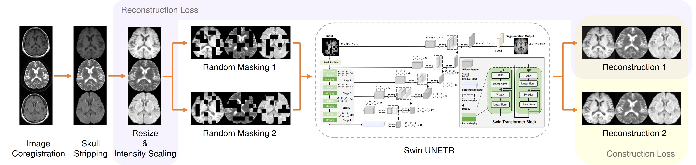

# Large Self-Supervised Vision Foundation Model
## Model Overview
This repository provides self-supervised pre-trained Shift Window UNET TRansformer (Swin UNETR), which was trained on 75,861 plain head MRI scans (4D volumes including T1w, T2w and FLAIR), for enhanced classification and segmentation. The training process is illustrated below:


## How to use

### Installing Dependencies
Dependencies can be installed using:
``` bash
pip install -r requirements.txt
```

### Download pretrained models
We provide the self-supervised pre-trained weights in [SSL_SwinUNETR](https://drive.google.com/file/d/1x1VI-0AoMqQZYVcbNoTQxe5ac-t3Ia5R/view?usp=drive_link) and [SSL_ViT](https://drive.google.com/file/d/1ttHL3IeZwuhjLPKS6SeLYjRQW-p6dD1U/view?usp=drive_link). Download and place them into the **Pretrained_models** folder.

### Data Prepare
1. Convert DICOM in NIFTI. [dcm2niix](https://github.com/rordenlab/dcm2niix) is recommended.
2. Skull strip. Choose T1 weight volume with higher resolutin for skull stripping. [HD-BET](https://github.com/MIC-DKFZ/HD-BET) is recommended. 
3. Remove redundant blank area using ExtractRegionFromImageByMask from [ANTs](https://github.com/ANTsX/ANTs).
4. Co-register other contrasts, e.g. T2w and FLAIR, to skull stripped T1w, then multiply with the brain mask generated in previous step.
5. Merge the co-registered and skull stripped volumes into a 3-channel 4D volume in the order of T1w, T2w and FLAIR.

### Fine tune the weights on downstream task
1. Modify ```train_files``` and ```val_files``` in finetune_train.py to point to the pre-processed train and validation images, and run finetune_train.py
2. Modify ```test_files``` in finetune_test.py to point the preprocessed test images, and run finetune_test.py to evaluate downstream model.
3. (Optional) Modify Models.py to test more classifier configurations.

## Pre-train from scratch with own data
It is highly recommended to perform pre-train with [Distributed Data Parallel](https://pytorch.org/docs/stable/notes/ddp.html) using NVIDIA Container on server equiped with multiple GPUs.
1. Pull the MONAI docker image
`docker pull projectmonai/monai`
2. Modify PATHs in run_docker.sh accordingly, then run ```run_docker.sh```
3. Run ```run_ssl_train.sh``` insider docker

